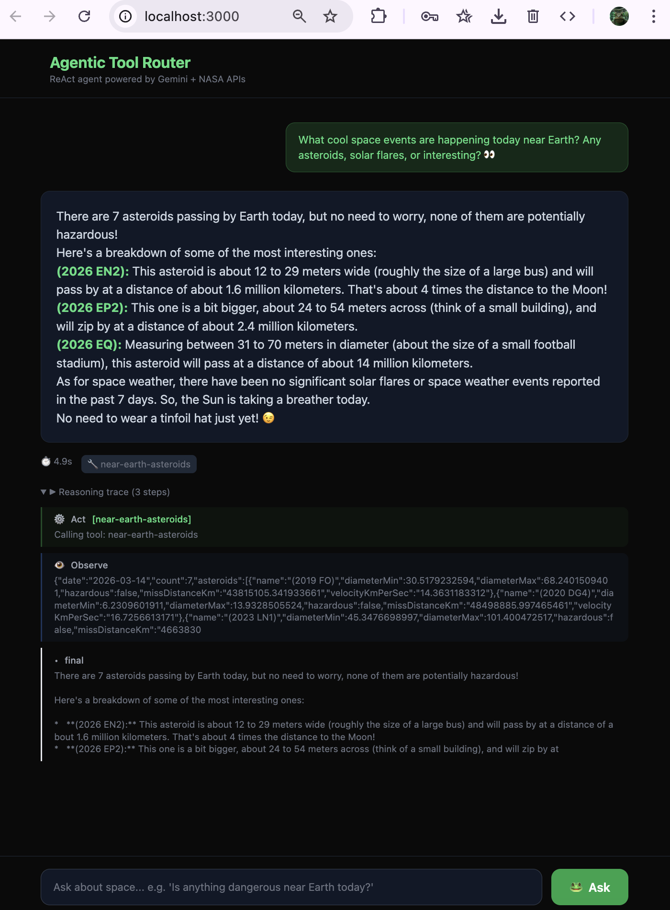

# Agentic Tool Router

**An AI agent that answers space questions using real-time NASA data.**

Ask a question in plain English — the agent decides which tools to call,<br/>
gathers live data, and returns a human-friendly answer with full reasoning trace.

<br/>



<br/>

</div>

---

## How It Works

The agent follows a **ReAct loop** — it thinks, acts, observes, and repeats until it has enough data:

```
🧠 THINK     "I need to check near-Earth asteroids"
⚙️ ACT       calls near-earth-asteroids tool
👁️ OBSERVE   "7 asteroids found, none hazardous"
🧠 THINK     "Let me also check solar activity"
⚙️ ACT       calls space-weather tool
👁️ OBSERVE   "No significant flares in the past 7 days"
🧠 THINK     "I have enough data to answer"
✅ ANSWER    "7 asteroids are passing by safely, the Sun is calm."
```

Every step is logged and returned as a **reasoning trace** — you see exactly how the agent arrived at its answer.

## Key Capabilities

|     | Capability                | What it does                                                               |
| --- | ------------------------- | -------------------------------------------------------------------------- |
| 🔀  | **Tool Routing**          | LLM autonomously decides which NASA APIs to call                           |
| 🧠  | **Multi-Step Reasoning**  | Gathers data across multiple tools before answering                        |
| 📊  | **Data Interpretation**   | Translates raw numbers into human terms (_"about 4x the Moon's distance"_) |
| 🔍  | **Transparent Reasoning** | Full trace of every think → act → observe step                             |

## Tools

| Tool                    | API         | What it returns                                                 |
| ----------------------- | ----------- | --------------------------------------------------------------- |
| 🛰️ **ISS Position**     | Open Notify | Real-time lat/lng of the International Space Station            |
| ☄️ **Asteroids**        | NASA NeoWs  | Near-Earth objects today — size, speed, distance, hazard status |
| 🌌 **Photo of the Day** | NASA APOD   | Astronomy Picture of the Day with explanation                   |
| ☀️ **Space Weather**    | NASA DONKI  | Solar flares and geomagnetic storms (past 7 days)               |

## Tech Stack

| Layer            | Technology                               |
| ---------------- | ---------------------------------------- |
| **Runtime**      | TypeScript, NodeNext, tsx                |
| **LLM**          | Gemini 2.5 Flash-Lite (function calling) |
| **Server**       | Hono                                     |
| **Frontend**     | Tailwind CSS (CDN) + marked.js           |
| **Architecture** | ReAct agent loop, provider pattern       |

## Quick Start

```bash
git clone https://github.com/vola-trebla/agentic-tool-router.git
cd agentic-tool-router
npm install
cp .env.example .env
```

Add your API keys to `.env`:

| Key              | Where to get                                           |
| ---------------- | ------------------------------------------------------ |
| `GEMINI_API_KEY` | [Google AI Studio](https://aistudio.google.com/apikey) |
| `NASA_API_KEY`   | [api.nasa.gov](https://api.nasa.gov) — free, instant   |

Run the server:

```bash
npx tsx src/index.ts
```

Open [http://localhost:3000](http://localhost:3000) and ask something about space.

## API

```bash
# Health check
curl http://localhost:3000/health

# Ask a question
curl -X POST http://localhost:3000/ask \
  -H "Content-Type: application/json" \
  -d '{"question": "Is anything dangerous near Earth today?"}'
```

Response includes `answer`, `steps` (reasoning trace), and `toolsUsed`.

## Project Structure

```
src/
├── index.ts              Hono server + static files
├── agent.ts              ReAct loop (think → act → observe → repeat)
├── config.ts             API keys and URLs
├── types.ts              Interfaces
├── logger.ts             Console reasoning trace
├── providers/
│   └── gemini.ts         Gemini LLM provider with function calling
└── tools/
    ├── registry.ts       Tool registry + lookup
    ├── iss.ts            ISS position
    ├── asteroids.ts      Near-Earth asteroids
    ├── apod.ts           Astronomy photo of the day
    └── space-weather.ts  Solar flares
public/
└── index.html            Web UI (Tailwind + marked.js)
```
